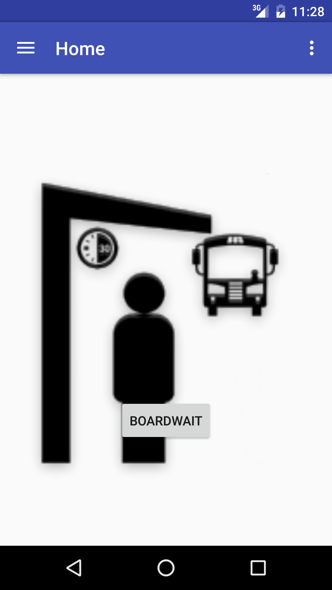

# BoardMeApp
Mobile app for the board me bus application. A small application built with a concept to solve issues with public transport for hackathon conducted by Nasdaq and hackerearth. Application built around beacon technology to help address public transportation booking issue with smart phones and better use of tech in minimising troubles.
Please go through the problem statement [here](https://github.com/rajagopal28/board-me-server/ProblemStatement.md)

### The architecture:

### The Application Flow:

### The BigPicture:

### The Flows:
#### BoardMe:
This is the flow in which the user boards a bus and pays through the app.
1. The user board the bus which has a beacon planted to it.
2. User opens the app and clicks board.
3. The system picks the nearest beacon as the reference.
4. The system pick the user location and send the data to the server.
5. The server computes the nearest stop in the route that the beacon belongs to and prompts the following destinations for him/her to choose.
6. The user choose the destination and pays through his app wallet.
7. The user travel history is recorded with the location that the user has boarded.
8. The user also receives a SMS confirmation.
#### BoardWait:
This is the flow in which the user boards a bus and pays through the app.
1. The user opens the app and choses the route he/she wishes to travel.
2. App send the user location and the chosen route to the server.
3. Server finds the stop, closest to the user, in the chosen route and computes the ETA though google API.
4. The app renders the ETA response from the server.

### TechUsed:
**Native android stack** - I’ve used Fragments/Pagers/Horizontal/vertical scrolls and the default async task whenever required.
**Google push notifications service** to send and receive notification in Native android
**Gimbal beacons** , connecting to mobile devices through Bluetooth technology. To get access to the boarded bus and other boarding related information in a contactless way.
**Twilio** To get notified on successful ticket booking
**GoogleMapsAPI** Maps and routing API to determine the transportation route based on the boarding points and destinations endpoints.

## User Views:
### Home

### Login

### Users

### UserInfo

### Routes

### BoardMe

### BoardWait

#### Choose Bus/Route

#### Payment

#### Bus/Route in Map

#### Ticket Confirmation

#### Booking notification

### BoardingHistory

### References:
The following are the references that has been used in the above detailed documentation:
#### Tech:
* Python-Flask-Mysql: http://code.tutsplus.com/tutorials/creating-a-web-app-from-scratch-using-python-flask-and-mysql--cms-22972
* Openshift deployment of Python:  https://github.com/caruccio/openshift-flask-mysql-example
* Material Design in android: http://developer.android.com/design/material/index.html
* Retrofit library of network calls in android:https://github.com/codepath/android_guides/wiki/Consuming-APIs-with-Retrofit
* Estimote beacons:  http://developer.estimote.com/eddystone/ https://github.com/estimote/android-sdk#quick-start-for-eddystone
* Architecture diagram: https://www.draw.io/
* Schema creation: http://www.vertabelo.com
* Twilio: https://www.twilio.com/docs/api  
* GoogleAPIClient for android: https://developers.google.com/android/guides/api-client
#### Statistical:
* Statistical reference on transportation in Chennai: http://www.cmdachennai.gov.in/pdfs/CCTS_Executive_Summary.pdf
* Article in The hindu: http://www.thehindu.com/news/cities/chennai/public-transport-system-chennai-has-miles-to-go/article1143993.ece
* Traffic stat in Chennai: http://chennaicityconnect.com/chennai-pedia/statistics/traffic-transportation/
* Submission : https://www.hackerearth.com/challenges/hackathon/techngage-chennai/dashboard/91048e6/submission/published/submission-12600-53506/
